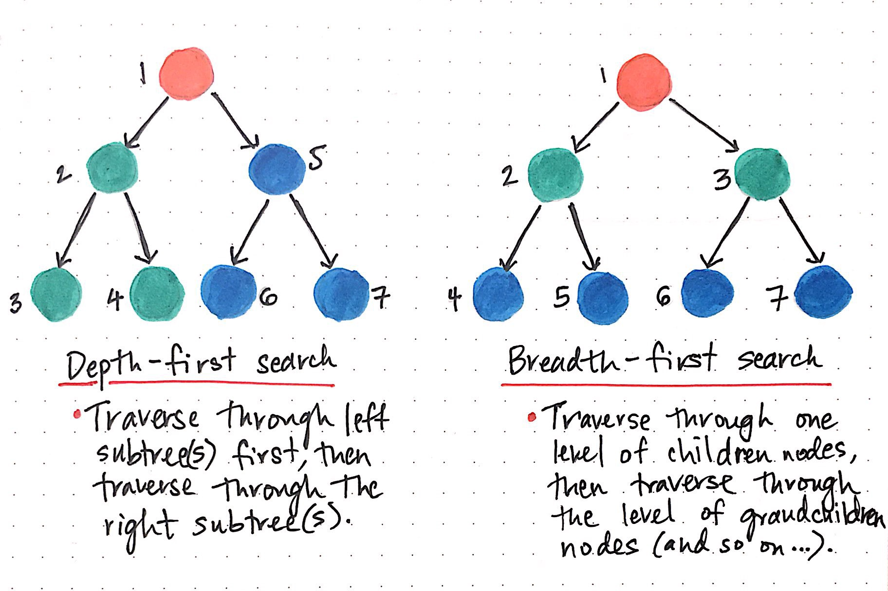

## Breadth-First Search
https://medium.com/basecs/breaking-down-breadth-first-search-cebe696709d9

### BFS - traverse level-to-level

### BFS - queue data structure

## Depth-First Search
https://medium.com/basecs/demystifying-depth-first-search-a7c14cccf056

### DFS - traverse down until a leaf then back to a "trunk" and down again until a leaf

### DFS - stack data structure

